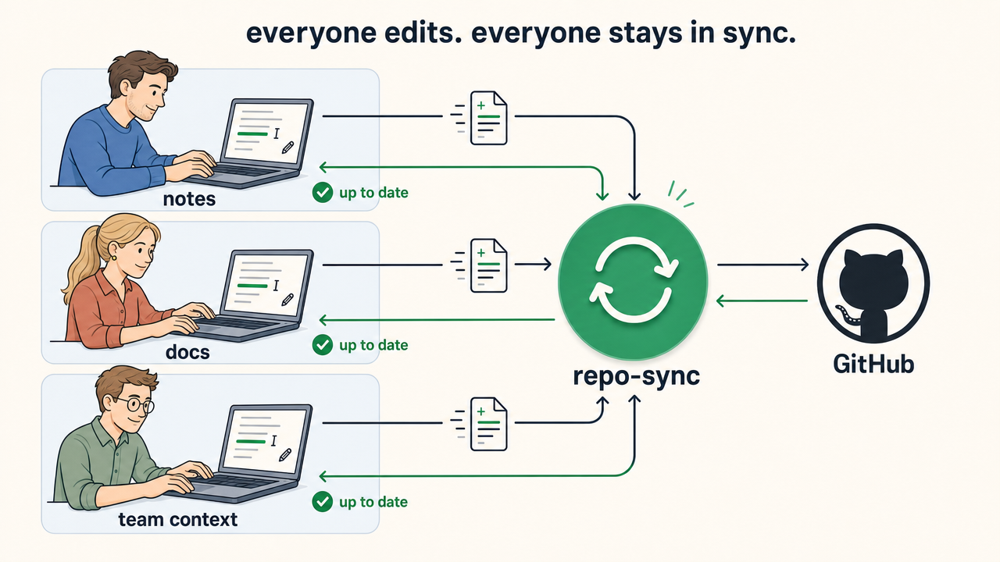

# repo-sync

Your Git repos, always in sync.

You edit. After 60 seconds of quiet, repo-sync commits, pulls, and pushes. It starts at login and runs in the background.

For notes, docs, config, and small team repos. macOS only.



## Install

```sh
brew install --cask vectal-labs/tap/repo-sync && repo-sync setup
```

Requires [Homebrew](https://brew.sh). Git and GitHub CLI are installed for you.

`setup` finds your repos, checks Git access, and starts the background service. You choose which repos to sync or enter a path. Nothing is preselected. It explains automatic commits and verifies the service before finishing.

<details>
<summary>Install with Go</summary>

Requires Go, Git, and the Xcode Command Line Tools. GitHub CLI (`gh`) is only needed if setup must configure GitHub authentication over HTTPS.

```sh
go install github.com/vectal-labs/repo-sync@latest
"$(go env GOPATH)/bin/repo-sync" setup
```

If you set `GOBIN`, use that directory instead. Add the binary directory to your `PATH` to use `repo-sync` directly.

</details>

## Usage

```sh
repo-sync add                # sync the repo you're in
repo-sync add ~/code/notes    # sync a repo by path
repo-sync status             # check the service and repositories
```

## Safety

- Secret filenames like `.env`, `*.pem`, and `.npmrc` are blocked by default. No content scanning.
- No force-pushes or automatic conflict resolution. On conflict, it aborts the rebase and retries later.
- Only the remote's default branch syncs. Feature branches stay untouched.

[Behavior and configuration](docs/behavior.md) · [Secret overrides](docs/behavior.md#secrets)

<details>
<summary>Uninstall</summary>

```sh
repo-sync uninstall
```

Asks before removing the service, settings, logs, cache, and installed binary. Repositories and shared Git credentials are preserved. Use `--yes` to skip confirmation, or `--keep-binary` to keep the program.

For Homebrew, `brew uninstall --cask --zap repo-sync` also removes the standard settings, logs, and cache. Plain `brew uninstall` stops the service and keeps those files.

</details>

[MIT license](LICENSE)
